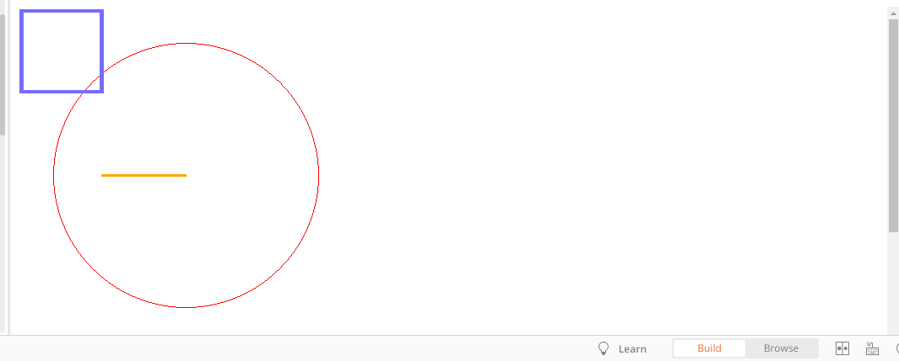

### 
Simple web app called “Graphic Editor” 
which draws geometric shapes such as
circle, square, rectangle, ellipse... etc. 

## Requirements

PHP 7.2
Postman

## Installation 

- Clone repository so that you can work on it 
- Run `composer install`
- Run Your localhost then in postman type 
       `{url}/draw`
- API Header
       `Content-Type:application/json`
#### API Body
       {
             "shapes": [
                 {
                     "type": "circle",
                     "perimeter": 10,
                     "border": {
                         "color": "yellow",
                         "width": 1
                     }
                 },
                 {
                     "type": "square",
                     "sideLength": 10,
                     "border": {
                         "color": "#776cff",
                         "width": 5
                     }
                 },
                 {
                     "type": "line",
                     "border": {
                         "color": "#776cff",
                         "width": 5
                     }
                 }'
    

### postman collection
https://www.getpostman.com/collections/c5ff5919d38ccc28bdc0

## Tools Used

 - PHP 7.1.3+
 - MySQL
 - Composer 
 - Lumen 
 
## outPut will be like   

